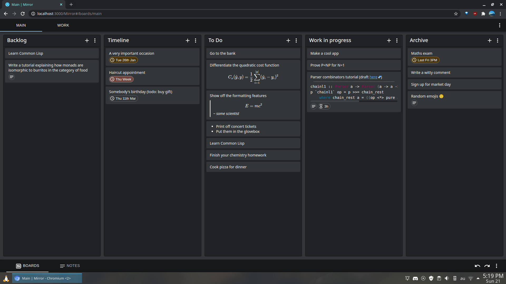

# Mirror Project

> *Mirror is a mobile friendly web app for task management and note taking. Your everyday tasks are a reflection of who you are, and you deserve high quality tools to stay on top of your workload.*

The app is available for free at [this link](https://oliverbalfour.github.io/Mirror/).

**Features**

- Mobile friendly web app
- Personal [Kanban](https://www.atlassian.com/agile/kanban/boards) boards
- [Zettelkasten](https://writingcooperative.com/zettelkasten-how-one-german-scholar-was-so-freakishly-productive-997e4e0ca125) knowledge management / note taking / reference tracking tool
- Cross device synchronisation (via the GitHub Gist API)
- [Free and open source](https://github.com/OliverBalfour/Mirror)
- Minimal design with light/dark themes

**Roadmap**

1. [x] Kanban boards
1. [x] Zettelkasten
1. [x] Synchronisation
1. [x] Mobile friendly
1. [ ] Quality of life fixes (small features, bug fixes, etc.)

**Synchronisation log in**

To log in via GitHub for synchronisation, [create a new token](https://github.com/settings/tokens/new) with the `gist` permission and save it somewhere safe. Then, go to [gist.github.com](https://gist.github.com) and create a new Gist with any title and add one file, `main.md`, with any contents. Then click "Create secret gist". Copy the ID from the URL. In the main popup menu (three dots in bottom right) select "Login via GitHub" and enter your token and the gist ID. You will need these two pieces of information on every new computer, so consider putting them in an encrypted text file in cloud storage. Note that the Gist ID can be used to read your notes without a token, so be extra careful with it!

**Implementation**

Built with React, Redux and Material UI. The project was bootstrapped with Create React App. Synchronisation makes use of Redux state serialisation and the GitHub Gist API.

## Setup (for developers)

If you just want to use the app, these steps are not necessary. Simply visit [this link](https://oliverbalfour.github.io/Mirror/) and start using the app!

### Installation

1. `git clone https://github.com/OliverBalfour/Mirror`
2. `cd Mirror`
3. `npm install` (you may need to run `npm rebuild node-sass` for later node versions)

### Development

- `npm start`: run debug version
- `npm run build`: build static version in `build` folder
- `npm run deploy`: build and deploy to [GitHub Pages](https://oliverbalfour.github.io/Mirror/)
- `npm run analyze`: analyze bundle size, you must run `npm run build` first for an up to date analysis

To force update to a new version in Chrome (without losing data) press Ctrl+F5. If that fails, open devtools, right click on browser refresh button, choose "Empty Cache & Hard Reload".

## Credits & License

Designed and built by Oliver Balfour. MIT License. If you copy my work attribution would be appreciated.

The app icon is [Mirror](https://thenounproject.com/term/mirror/340140/) by Lastspark from [The Noun Project](http://thenounproject.com/).
